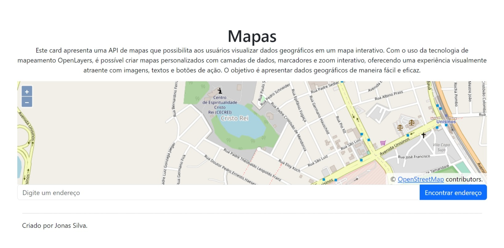
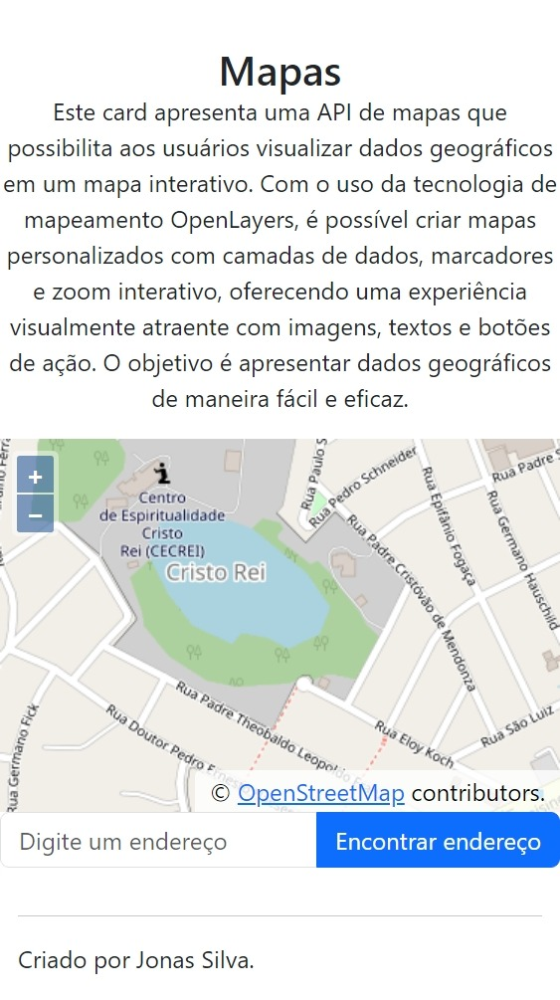

# OpenLayers API - Tarefa Unisinos

 <h1 >Mapas</h1>
      

        Este é um card da API de mapas que permite aos usuários visualizar dados
        geográficos em um mapa interativo. Com o uso da tecnologia de mapeamento
        OpenLayers, é possível criar mapas personalizados com camadas de dados,
        marcadores e zoom interativo. Além disso, este card oferece uma
        experiência visualmente atraente para seus usuários, com a possibilidade
        de incluir imagens, textos e botões de ação. Use esta API de mapas para
        apresentar seus dados geográficos de uma forma fácil e eficaz!
      

      
Criado por Jonas.

## Versão Desktop

## Versão Mobile

### Demonstração

<a target="_blank" href="https://pagina-de-mapas.vercel.app/">Clique aqui</a>
